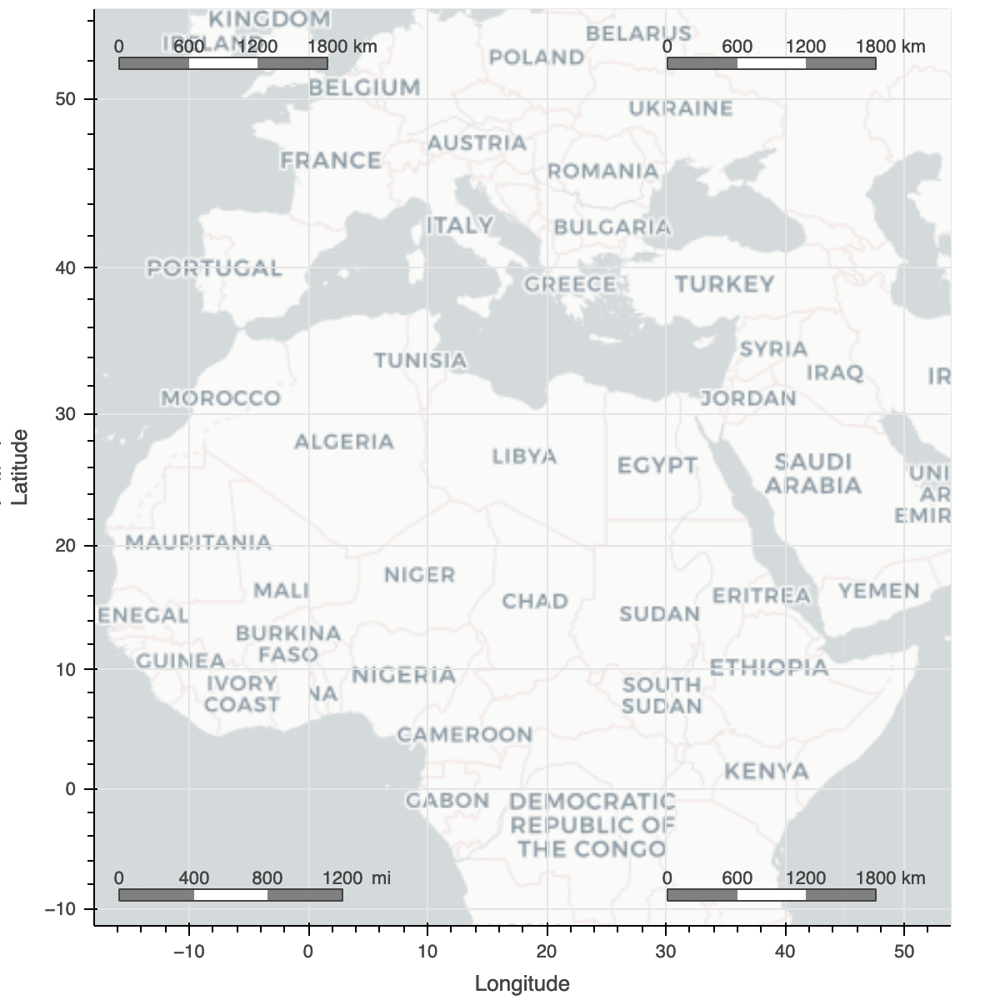
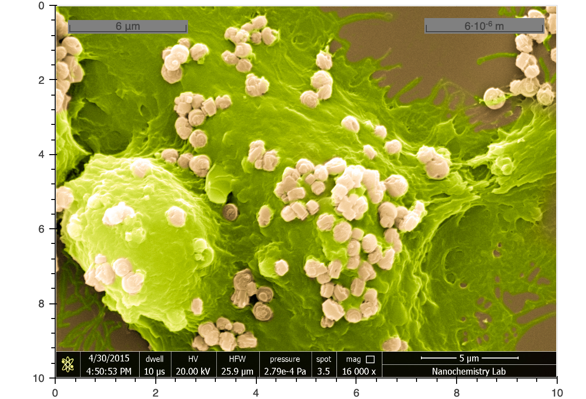
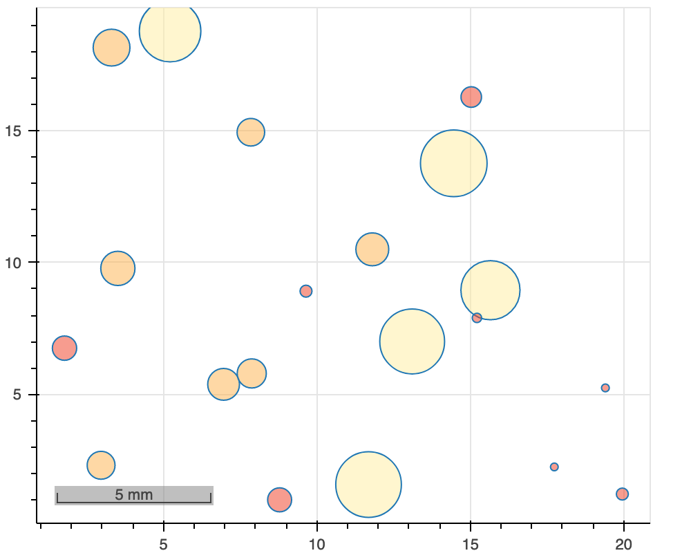

# Scale bar

ScaleBar is an annotation in screen units that can be used to indicate length/size on an image, map tile or a regular plot.
As with Bokehs other annotations one would add the annotation using `add_layout`. The scale bar supports zooming, hence scale labels get updated when zooming in or out. The length of the scale bar also adjusts accordingly in order to have nice values for the labels. Two types of scales are available through the `scale_type` argument: `bar` or `line`. The `bar` type scale is a horizontal bar with alternating dark and light colors, mainly used on maps. The `line` scale is a simple horizontal line with start and end indicators and just one number showing the distance that the length of the scale bar represents.

`px_size` argument is used to indicate data units per pixel. Acceptable values are `auto`, `mercator` or a positve number. Using `auto` the pixel size is determined automatically from range limits of the x-axis, `mercator` is based on great circle distance between 2 points, while if specifing a number that number is the pixel size. Unit of scale, `unit`, with default value of `m`. Acceptable values are `m` with SI predix or imperial units `in`, `ft` and `mi`. Ignored if `px_size` is equal to `mercator` which is fixed to `m`. One will use system of measurement, `system_of_measure`, to indicate what `unit` and `px_size` is based on. Acceptable values are: `metric` (SI pefix), `imperial` (in, ft and mi) or `scientific` (scientific notation eg. 10⁵).

This is a [Bokeh custom extension](https://docs.bokeh.org/en/latest/docs/user_guide/extensions.html), where the Python class itself is very simple, since it is on the JavaScript side where the model is implemented using TypeScript. Besides having Bokeh installed one also needs node.js installed in order to use the annotation.

The images below show different uses of the scale bar (output from the script `scalebar_example.py`).

<table>
   <tr>
      <td></img></td>
      <td>Use of scale bar on map tiles with <code>px_size='mercator'</code>.
      4 scales on the map to show use of location argument.
      Also, one scale use imperial units, the rest the default metric.
      </td>
   </tr> 
   <tr>
      <td></img></td>
      <td>Use of scale bar on an image using Bokeh <code>image_url</code>. In this case a specific value for <code>px_size</code> is being specified.
         The width of the SEM image is 25.9 μm and width argument <code>w</code> in <code>image_url</code> is 10, hence <code>px_size=2.59</code>.
         Two scale bars where one is using scientific notation.
      </td>
   </tr>  
   <tr>
      <td>
         </img>
      </td>
      <td>
         Example using <code>px_size='auto'</code>. Using circle glyph with radius specified, hence data units.
         The scale bar could in this case relate to the size of the circles.
      </td>
   </tr>
</table>
